# Домашнее задание к занятию "`Системы контроля версий`" - `Некрасов Александр`

---

### Цель задания
В результате выполнения задания вы:

* научитесь подготоваливать новый репозиторий к работе;
* сохранять, перемещать и удалять файлы в системе контроля версий.

### Чеклист готовности к домашнему заданию

1. Установлена консольная утилита для работы с Git.

### Инструкция к заданию
1. Домашнее задание выполните в GitHub-репозитории.
2. В личном кабинете отправьте на проверку ссылку на ваш репозиторий с домашним заданием.
3. Любые вопросы по решению задач задавайте в разделе "Вопросы по заданию".

### Дополнительные материалы для выполнения задания
1. GitHub.
2. Инструкция по установке Git.
3. Книга про Git на русском языке - рекомендуем к обязательному изучению главы 1-7.

### Задание 1. Создать и настроить репозиторий для дальнейшей работы на курсе
В рамках курса вы будете писать скрипты и создавать конфигурации для различных систем, которые необходимо сохранять для будущего использования. Сначала надо создать и настроить локальный репозиторий, после чего добавить удалённый репозиторий на GitHub.

### Создание репозитория и первого коммита
1. Зарегистрируйте аккаунт на https://github.com/. Если предпочитаете другое хранилище для репозитория, можно использовать его.
2. Создайте публичный репозиторий, который будете использовать дальше на протяжении всего курса, желательное с названием devops-netology. Обязательно поставьте галочку Initialize this repository with a README.
3. Диалог создания репозитория
4. Создайте авторизационный токен для клонирования репозитория.
5. Склонируйте репозиторий, используя протокол HTTPS (git clone ...).
6. Клонирование репозитория
7. Перейдите в каталог с клоном репозитория (cd devops-netology).
8. Произведите первоначальную настройку Git, указав своё настоящее имя, чтобы нам было проще общаться, и email (git config --global user.name и git config --global user.email johndoe@example.com).
9. Выполните команду git status и запомните результат.
10. Отредактируйте файл README.md любым удобным способом, тем самым переведя файл в состояние Modified.
11. Ещё раз выполните git status и продолжайте проверять вывод этой команды после каждого следующего шага.
12. Теперь посмотрите изменения в файле README.md, выполнив команды git diff и git diff --staged.
13. Переведите файл в состояние staged (или, как говорят, просто добавьте файл в коммит) командой git add README.md.
14. И ещё раз выполните команды git diff и git diff --staged. Поиграйте с изменениями и этими командами, чтобы чётко понять, что и когда они отображают.
15. Теперь можно сделать коммит git commit -m 'First commit'.
16. И ещё раз посмотреть выводы команд git status, git diff и git diff --staged.

### Создание файлов .gitignore и второго коммита
1. Создайте файл .gitignore (обратите внимание на точку в начале файла), проверьте его статус сразу после создания.
2. Добавьте файл .gitignore в следующий коммит (git add...).
3. На одном из следующих блоков вы будете изучать Terraform, давайте сразу создадим соотвествующий каталог terraform и внутри этого каталога — файл .gitignore по примеру: https://github.com/github/gitignore/blob/master/Terraform.gitignore.
4. В файле README.md опишите своими словами, какие файлы будут проигнорированы в будущем благодаря добавленному .gitignore.
5. Закоммитьте все новые и изменённые файлы. Комментарий к коммиту должен быть Added gitignore.

### Эксперимент с удалением и перемещением файлов (третий и четвёртый коммит)
1. Создайте файлы will_be_deleted.txt (с текстом will_be_deleted) и will_be_moved.txt (с текстом will_be_moved) и закоммите их с комментарием Prepare to delete and move.
2. В случае необходимости обратитесь к официальной документации — здесь подробно описано, как выполнить следующие шаги.
3. Удалите файл will_be_deleted.txt с диска и из репозитория.
4. Переименуйте (переместите) файл will_be_moved.txt на диске и в репозитории, чтобы он стал называться has_been_moved.txt.
5. Закоммитьте результат работы с комментарием Moved and deleted.

### Проверка изменения
1. В результате предыдущих шагов в репозитории должно быть как минимум пять коммитов (если вы сделали ещё промежуточные — нет проблем):
    * Initial Commit — созданный GitHub при инициализации репозитория.
    * First commit — созданный после изменения файла README.md.
    * Added gitignore — после добавления .gitignore.
    * Prepare to delete and move — после добавления двух временных файлов.
    * Moved and deleted — после удаления и перемещения временных файлов.
2. Проверьте это, используя комманду git log. Подробно о формате вывода этой команды мы поговорим на следующем занятии, но посмотреть, что она отображает, можно уже сейчас.

### Отправка изменений в репозиторий
Выполните команду git push, если Git запросит логин и пароль — введите ваши логин и пароль от GitHub.

В качестве результата отправьте ссылку на репозиторий.

### Правила приёма домашнего задания
В личном кабинете отправлена ссылка на ваш репозиторий.

### Критерии оценки
Зачёт:

выполнены все задания;
ответы даны в развёрнутой форме;
приложены соответствующие скриншоты и файлы проекта;
в выполненных заданиях нет противоречий и нарушения логики.
На доработку:

задание выполнено частично или не выполнено вообще;
в логике выполнения заданий есть противоречия и существенные недостатки.

--- 

### Решение 1
### Создание репозитория и первого коммита
Первоначальная настройка Git, выполнение команды git status
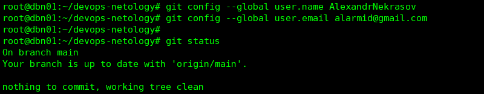

Редактирование файла README.md, перевод файла в состояние Modified
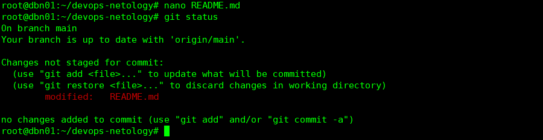

Выполнение команды git diff
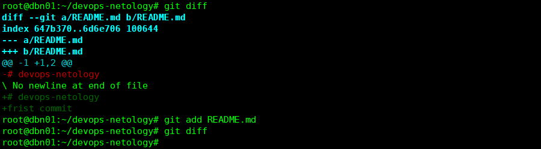

Первый коммит
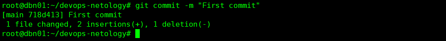

Повторный вывод команды git status
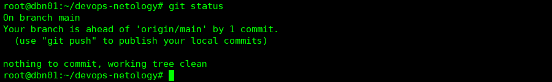

### Создание файлов .gitignore и второго коммита
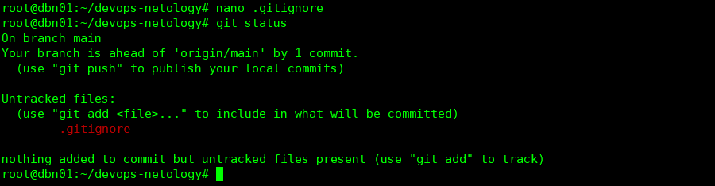

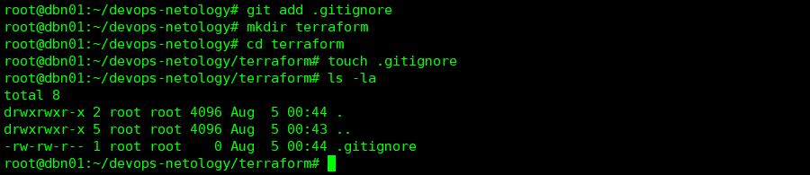

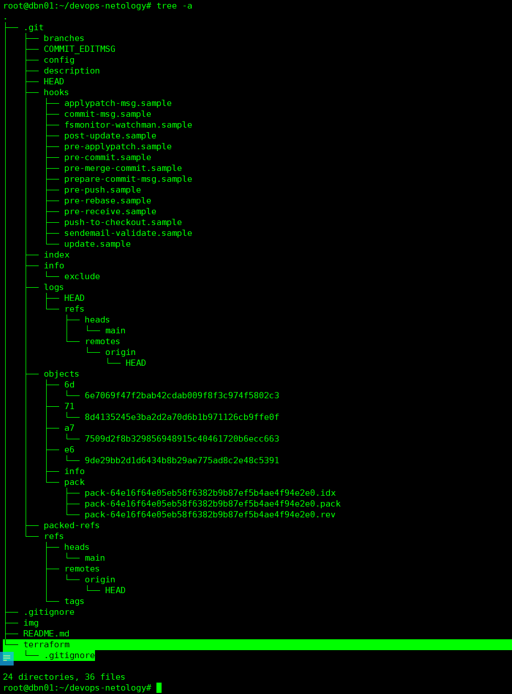

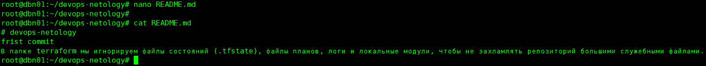

Игнорироваться будут следующие файлы с масками:
Файлы .tfstate (любое словосочетание.tfstate, любое словосочетание.tfstate.любое словосочетание)
*.tfstate
*.tfstate.*

Файлы журналов сбоев (файл с именем и расширением crash.log, любые файлы где в начале имени crash.любое словосочетание.log)
crash.log
crash.*.log

Исключить все файлы .tfvars, которые могут содержать конфиденциальные данные, такие как пароли, закрытые ключи и другие секреты. Они не должны быть частью системы контроля версий, поскольку это потенциально конфиденциальные данные, которые могут быть изменены в зависимости от среды.
Файлы .tfvars (любое словосочетание.tfvars, любое словосочетание.tfvars.json)
*.tfvars
*.tfvars.json

Игнорировать файлы переопределения, так как они обычно используются для локального переопределения ресурсов и поэтому не добавляются в систему контроля версий
Файлы: override.tf, override.tf.json, любое словосочетание_override.tf, любое словосочетание_override.tf.json 
override.tf
override.tf.json
*_override.tf
*_override.tf.json

Игнорирование временных файлов информации о блокировках, созданные командой `terraform apply`
Файлы: любое словосочетание.terraform.tfstate.lock.info
.terraform.tfstate.lock.info

Игнорирование файлов конфигурации CLI
Файлы: любое словосочетание..terraformrc, terraform.rc
.terraformrc
terraform.rc

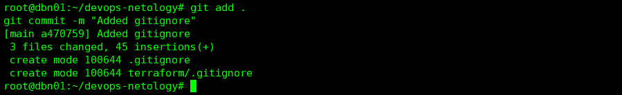

### Эксперимент с удалением и перемещением файлов (третий и четвёртый коммит)
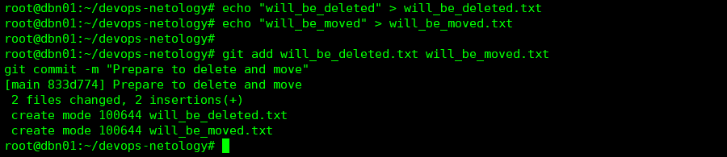

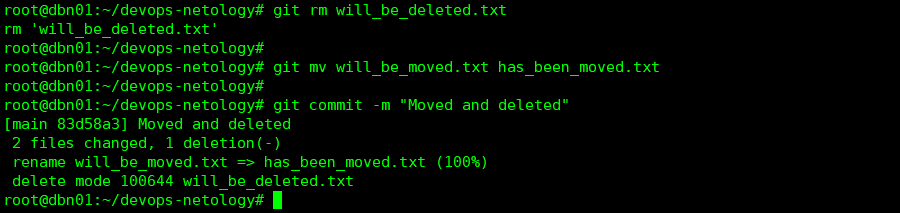

### Проверка изменения
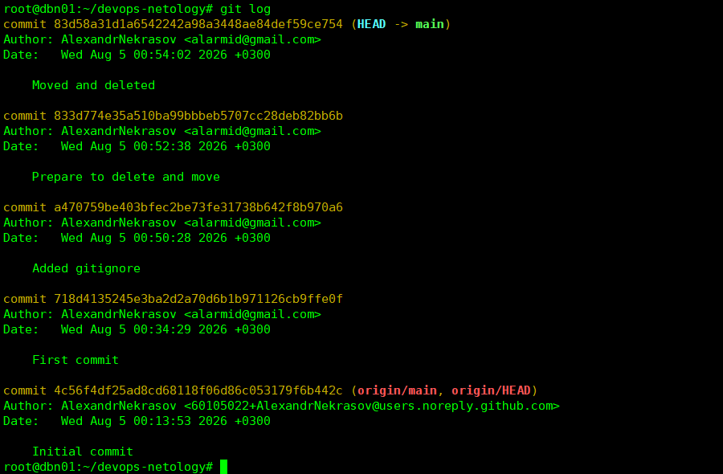

### Отправка изменений в репозиторий
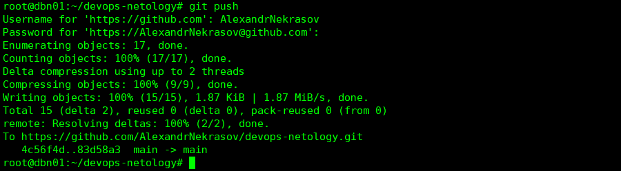

